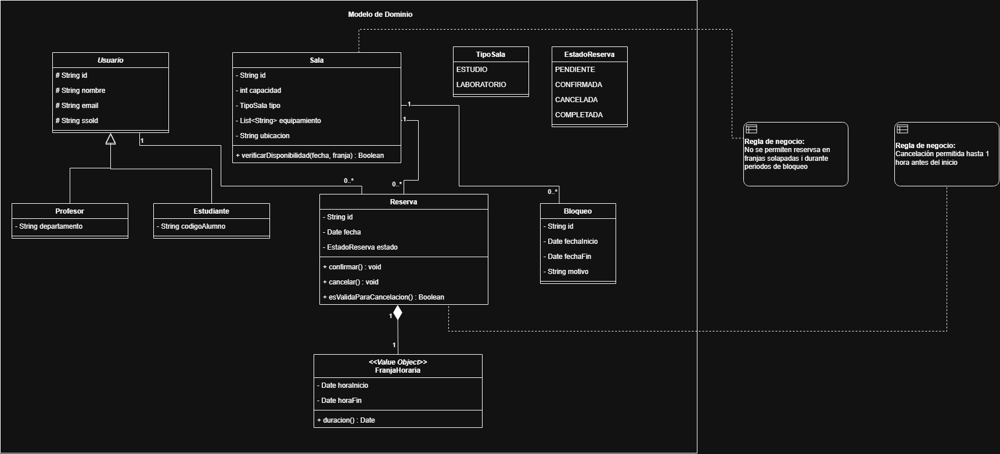
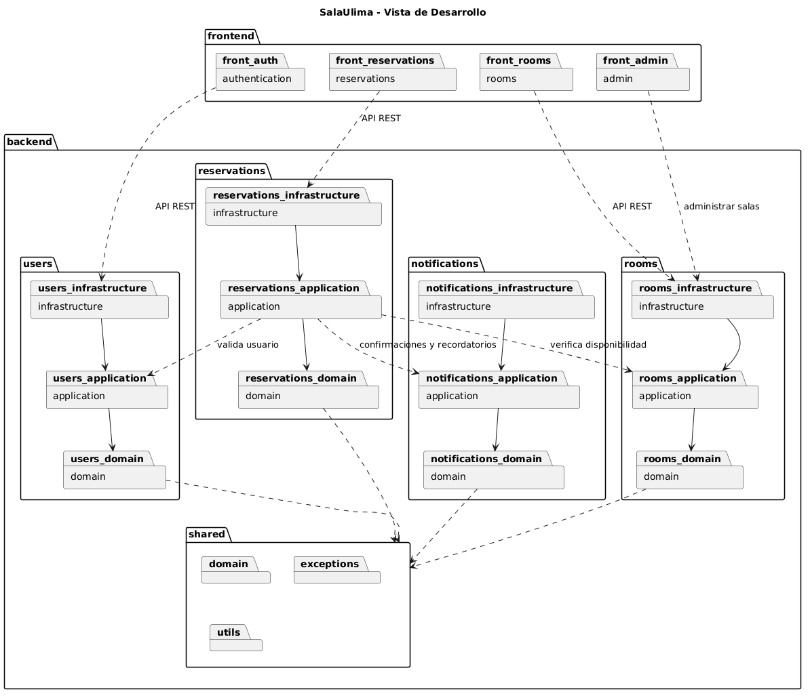
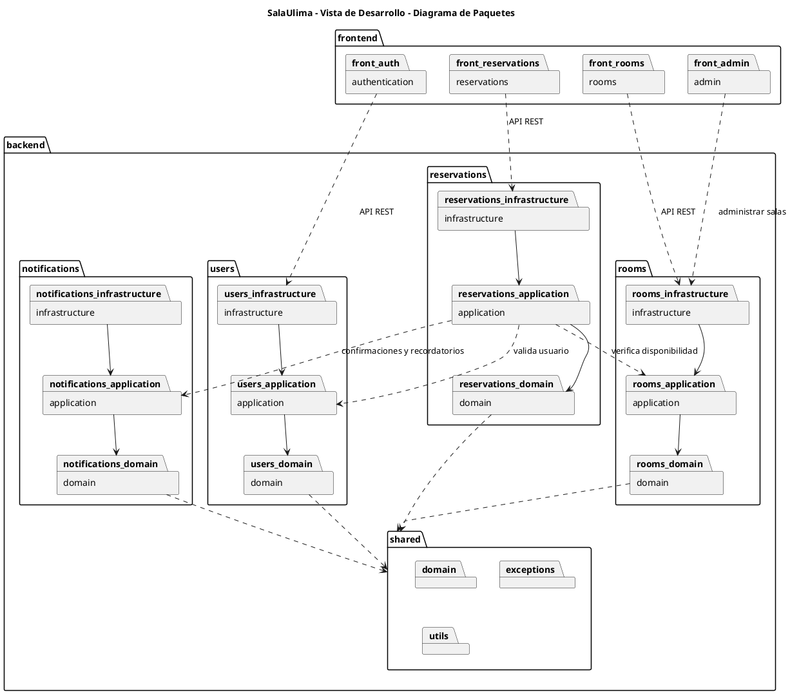
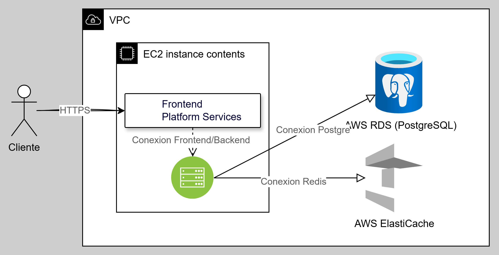

# Taller: Modelo 4+1 — Taller Integrador
**Curso:** Ingeniería de Software 2 · 2026-1
**Tema:** Integración de las 5 vistas del Modelo 4+1 para documentar un sistema completo

---

## Objetivo
Aplicar las cinco vistas del modelo 4+1 de forma integrada para documentar la arquitectura completa de un nuevo sistema, verificando la coherencia entre vistas y comunicando la arquitectura a diferentes audiencias.

---

## Caso de estudio: Sistema de Reserva de Salas — SalaUlima

Para este taller se les ha pedido implementar el sistema de reserva de salas de estudio y laboratorios de la Universidad de Lima (**SalaUlima**).

**Descripción del sistema:**
- Los estudiantes y profesores pueden reservar salas de estudio o laboratorios de cómputo
- Cada sala tiene capacidad, equipamiento y horarios disponibles
- Las reservas son por franjas horarias (ej: 10:00-12:00)
- Se puede cancelar una reserva hasta 1 hora antes del inicio
- El sistema envía recordatorios 30 minutos antes de la reserva
- El administrador puede bloquear salas por mantenimiento

**Actores:** Estudiante, Profesor, Administrador
**Sistemas externos:** SSO Universitario, SendGrid (notificaciones)
**Atributo de calidad crítico:** Disponibilidad 99% (las reservas se hacen online, pero el acceso a la sala es presencial)

---

## Ejercicio 1: Vista Lógica — Modelo del dominio

Crea el **diagrama de clases UML** del dominio de SalaUlima.

**Entidades mínimas a incluir:**
- `Sala` (con capacidad, tipo, equipamiento, ubicación)
- `Reserva` (con fecha, franja horaria, estado)
- `FranjaHoraria` (inicio, fin)
- `Usuario` abstracta con `Estudiante` y `Profesor`
- `Bloqueo` (administrador bloquea una sala por mantenimiento)

**Reglas de negocio a reflejar:**
- Una `Sala` puede tener múltiples `Reserva` pero no en franjas solapadas
- Una `Reserva` puede estar en: PENDIENTE, CONFIRMADA, CANCELADA, COMPLETADA
- Un `Bloqueo` tiene fecha inicio, fecha fin y motivo

**Entregable:** Diagrama de clases con multiplicidades y métodos clave.

**Clase Sala**

verificarDisponibilidad(fecha, franja): Boolean

**Clase Reserva**

confirmar(): void

cancelar(): void

esValidaParaCancelacion(): Boolean

**Clase FranjaHoraria**

duracion(): Date

---

## Ejercicio 2: Vista de Procesos — Comportamiento dinámico

Crea DOS diagramas:

**2a. Diagrama de estados** del objeto `Reserva`:
- Estados: PENDIENTE → CONFIRMADA → COMPLETADA
- Transiciones: cancelación (antes de 1h), no-show (expiración sin confirmación)
- Incluir acciones de entrada/salida

**2b. Diagrama de secuencia** para "Estudiante reserva una sala":
1. El estudiante busca salas disponibles para una fecha y horario
2. El sistema verifica disponibilidad (no hay solapamiento con otras reservas ni bloqueos)
3. El estudiante confirma la reserva
4. El sistema registra la reserva y envía confirmación por email
5. 30 minutos antes: el sistema envía un recordatorio (proceso batch)

**Entregable:** Diagrama de estado y diagrama de secuencia.
## Diagrama de estados

## Diagrama de secuencia

---

## Ejercicio 3: Vista de Desarrollo — Organización del código

**Diagrama de paquetes** de SalaUlima con arquitectura hexagonal.

**Módulos de dominio:**
- `rooms` — catálogo y disponibilidad de salas
- `reservations` — gestión de reservas
- `users` — autenticación y perfiles
- `notifications` — envío de recordatorios y confirmaciones

**Requisitos:**
- Cada módulo con sus sub-paquetes `domain`, `application`, `infrastructure`
- Dependencias correctas (nunca infrastructure → domain directamente en módulos ajenos)
- Módulo `shared` para código transversal

**Diagrama de paquetes en PlantUML:**

### Código PlantUML

---

## Ejercicio 4: Vista Física — Infraestructura de despliegue

Crea el **diagrama de despliegue** para el entorno de producción de SalaUlima.

**Restricciones de infraestructura:**
- Presupuesto limitado: solo 1 EC2 t3.small (sin cluster)
- RDS t3.micro PostgreSQL
- Sin CDN (el frontend está en el mismo servidor)
- Redis ElastiCache para evitar solapamientos de reserva (lock distribuido)

**Tarea adicional:** ¿Qué riesgo de disponibilidad introduce esta arquitectura de menor costo? ¿Cómo lo documenta la Vista Física?

**Diagrama de despliegue + análisis de riesgo:**

### Análisis de Riesgos:

El mayor riesgo de esta arquitectura es que introduce un SPOF (Single Point of Failure) absoluto en el servidor EC2.

1. Falta de Redundancia y Alta Disponibilidad (HA): Al haber solo un EC2 sin cluster, si el servidor se cae (por un fallo de hardware de AWS), toda la aplicación SalaUlima queda completamente fuera de línea. No hay balanceador de carga para levantar otra instancia automáticamente.

2. Saturación por Concurrencia: La instancia t3.small tiene solo 2 vCPUs y 2 GB de RAM. Al compartir el Frontend y el Backend en la misma máquina, un pico de usuarios reservando salas puede agotar la memoria, provocando que el sistema operativo mate los procesos.

3. Actualizaciones con Interrupción: Cualquier despliegue de nueva versión o mantenimiento del servidor requerirá reiniciar el servicio, generando tiempo de inactividad.
---

## Ejercicio 5: Vista de Escenarios — Validación cruzada

Elige el escenario **"Dos estudiantes intentan reservar la misma sala en la misma franja simultáneamente"** y valida la arquitectura:

**Tabla de trazabilidad:**
| Vista | Elementos involucrados | ¿La vista lo soporta correctamente? |
|---|---|---|
| Lógica | ? | ? |
| Procesos | ? | ? |
| Desarrollo | ? | ? |
| Física | ? | ? |

**Diagrama de secuencia** del escenario con control de concurrencia.

**Pregunta clave:** La Vista Física muestra que Redis se usa para lock distribuido. ¿Cómo se refleja esto en la Vista de Procesos (diagrama de secuencia)?

**Entregable:** Tabla de trazabilidad + diagrama de secuencia con lock de Redis.

---

## Ejercicio 6: Documento de arquitectura integrado

### Resumen ejecutivo de arquitectura — SalaUlima

SalaUlima es un sistema web para realizar reservas de sala de estudio y laboratorios de cómputo de la Universidad de Lima.
La arquitectura se documenta según el modelo 4+1 para asegurar la coherencia entre dominio, los procesos, la organización del código, la infraestructura y los escenarios críticos de uso.

##### 1. Tabla de vistas

| Vista | Diagrama utilizado | Propósito | Audiencia principal |
|---|---|---|---|
| Vista lógica | Diagrama de clases | Permite la repretación de entiendades como Sala, Reserva, FranjaHoraria, Usuario y Bloqueo. | Analistas, desarrolladores y arquitectos |
| Vista de procesos | Diagramas de estados y secuencia | Explica el ciclo de vida de una reserva y el flujo para reservar una sala. | Desarrolladores y QA |
| Vista de desarrollo | Diagrama de paquetes | Organiza el sistema en módulos hexagonales: rooms, reservations, users, notifications y shared. | Equipo de desarrollo |
| Vista física | Diagrama de despliegue | Muestra la infraestructura productiva: EC2, RDS PostgreSQL, Redis ElastiCache, SSO y SendGrid. | DevOps, TI y dirección |
| Vista de escenarios | Secuencia con concurrencia | Valida casos críticos como dos estudiantes reservando la misma sala simultáneamente. | Arquitectos, QA y stakeholders |

#### 2. Matriz de trazabilidad

| Escenario | Lógica | Procesos | Desarrollo | Física |
|---|---|---|---|---|
| Estudiante reserva una sala | Usa Sala, Reserva y FranjaHoraria | Flujo de búsqueda, validación y confirmación | reservations consume rooms y notifications | EC2 procesa, RDS guarda, SendGrid notifica |
| Cancelación antes de 1 hora | Regla en Reserva | Transición a CANCELADA | reservations/application valida regla | RDS actualiza estado |
| Recordatorio 30 minutos antes | Reserva confirmada | Batch de recordatorio | notifications/application programa envío | EC2 ejecuta proceso y SendGrid envía |
| Bloqueo por mantenimiento | Bloqueo asociado a Sala | Validación evita reservas | rooms gestiona disponibilidad | RDS registra bloqueo |
| Dos estudiantes reservan simultáneamente | Evita solapamiento de reservas | Redis bloquea franja antes de confirmar | reservations usa puerto de lock | Redis ElastiCache controla concurrencia |

#### 3. Top 3 decisiones arquitectónicas

**ADR 1: Usar arquitectura hexagonal por módulos.**
Se encuentra separado el dominio, aplicación e infraestructura para reducir el acoplamiento y poder realizar pruebas fácilmente. Esot permite que se escalen las reservas, usuarios, salas y notificaciones sin mezclar sus responsabilidades.

**ADR 2: Usar Redis como lock distribuido.** 
La implementación de Redis evita que dos usuarios reseven una misma sala y franaja en el mismo tiempo, pues antes de registrar una reserva en PostgreSQL, el sistema debe adquirir un bloqueo temporal por sala, fecha y horario.

**ADR 3: Desplegar en una sola EC2 por restricción de presupuesto.** 
El frontend y backend se encuentran alojados dentro del mismo servidor para que se reduzcan los costos. Sin embargo, esta desición se aplica sobre un caso concreto de falla donde se afecta a la disponbilidad del sistema.

#### 4. Riesgos identificados

1. **Punto único de falla en EC2:** si el servidor cae, el sistema completo deja de estar disponible.  
2. **Riesgo de indisponibilidad de Redis:** si Redis falla, podría afectarse el control de concurrencia.  
3. **Dependencia de servicios externos:** una falla en SSO impide iniciar sesión y una falla en SendGrid afecta confirmaciones y recordatorios.  
4. **Capacidad limitada:** una EC2 t3.small podría saturarse en horarios de alta demanda, como semanas de parciales o finales.

#### 5. Comunicación de la arquitectura
En el caso de unn **nuevo desarrollador**, explicaría primero el dominio sobre qué es una sala, una reserva, una franja horaria y un bloqueo. Luego mostraría la arquitectura hexagonal, indicando dónde colocar reglas de negocio, casos de uso, repositorios y adaptadores externos.

Mientas que para el **director de TI**, se comunicaría la arquitectura desde el valor y el riesgo donde el sistema mejora la gestión de espacios académicos, reduce conflictos de reserva y automatiza notificaciones. También resaltaría que la infraestructura cumple con un presupuesto limitado, pero no garantiza plenamente el 99% de disponibilidad debido al uso de una sola EC2.
