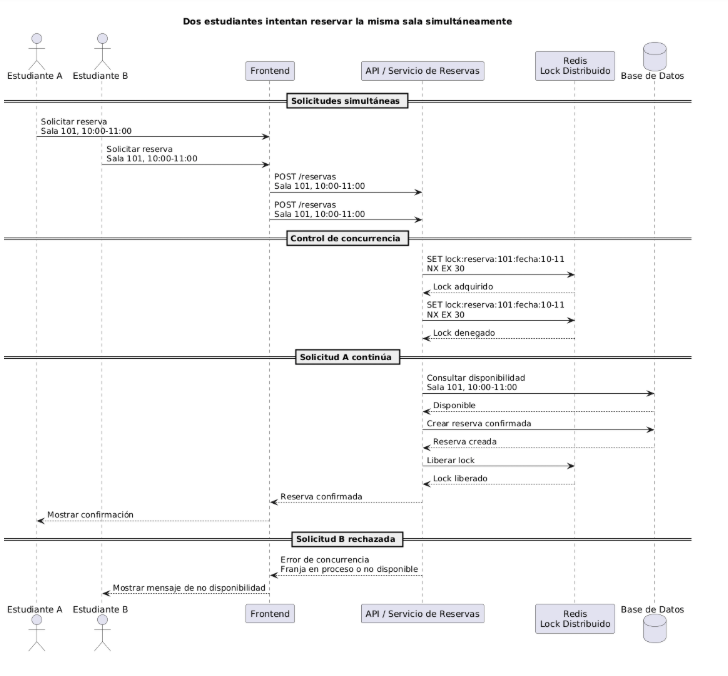

## Tabla de trazabilidad

| Vista | Elementos involucrados | ¿La vista lo soporta correctamente? |
|---|---|---|
| Lógica | Entidad Reserva, Sala, Estudiante, Franja Horaria, reglas de negocio de disponibilidad | Sí. La vista lógica debe definir que una sala no puede tener más de una reserva confirmada en la misma franja horaria. Esta restricción es parte de la lógica del dominio. |
| Procesos | Solicitud concurrente de reserva, servicio de reservas, validación de disponibilidad, lock distribuido con Redis, confirmación o rechazo de reserva | Sí. La vista de procesos debe mostrar que antes de validar y crear la reserva, el sistema intenta adquirir un lock en Redis para la combinación sala + fecha + franja. Solo una solicitud puede continuar. |
| Desarrollo | Módulo/API de reservas, servicio de reservas, cliente Redis, repositorio de reservas, manejo de errores de concurrencia | Sí. La vista de desarrollo debe reflejar que el código separa responsabilidades: controlador/API, servicio de negocio, acceso a datos y componente de lock distribuido. |
| Física | Servidor de aplicación/API, base de datos, Redis como componente externo para lock distribuido | Sí. La vista física soporta el escenario porque Redis permite coordinar múltiples instancias del backend y evitar reservas duplicadas aunque las solicitudes lleguen al mismo tiempo. |
